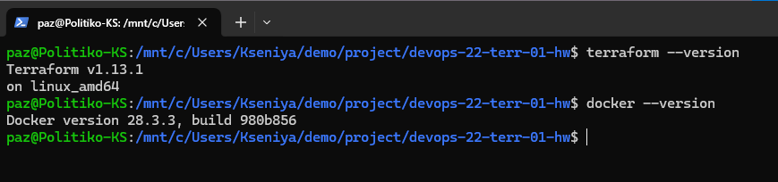
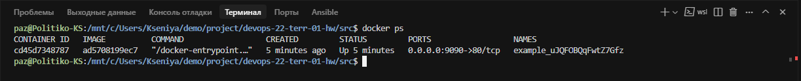
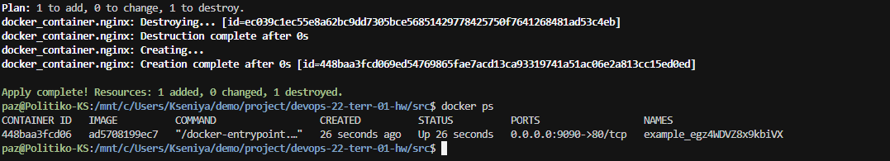
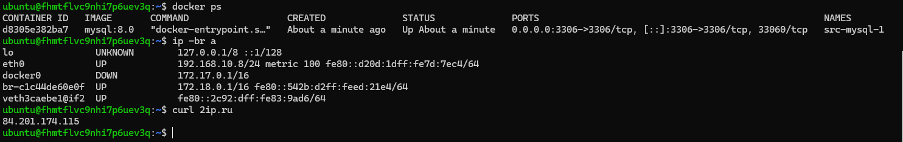
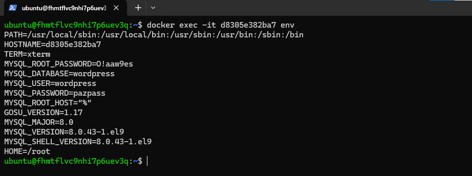

# Домашнее задание к занятию «Введение в Terraform»

### Цели задания

1. Установить и настроить Terrafrom.
2. Научиться использовать готовый код.

---

### Чек-лист готовности к домашнему заданию

1. Скачайте и установите **Terraform** версии >=1.8.4 . Приложите скриншот вывода команды ``terraform --version``.
2. Скачайте на свой ПК этот git-репозиторий. Исходный код для выполнения задания расположен в директории **01/src**.
3. Убедитесь, что в вашей ОС установлен docker.

---

### Инструменты и дополнительные материалы, которые пригодятся для выполнения задания

1. Репозиторий с ссылкой на зеркало для установки и настройки Terraform: [ссылка](https://github.com/netology-code/devops-materials).
2. Установка docker: [ссылка](https://docs.docker.com/engine/install/ubuntu/).

---

### Внимание!! Обязательно предоставляем на проверку получившийся код в виде ссылки на ваш github-репозиторий!

---

### Задание 1

1. Перейдите в каталог [**src**](https://github.com/netology-code/ter-homeworks/tree/main/01/src). Скачайте все необходимые зависимости, использованные в проекте.
2. Изучите файл **.gitignore**. В каком terraform-файле, согласно этому .gitignore, допустимо сохранить личную, секретную информацию?(логины,пароли,ключи,токены итд)
3. Выполните код проекта. Найдите  в state-файле секретное содержимое созданного ресурса **random_password**, пришлите в качестве ответа конкретный ключ и его значение.
4. Раскомментируйте блок кода, примерно расположенный на строчках 29–42 файла **main.tf**.
   Выполните команду ``terraform validate``. Объясните, в чём заключаются намеренно допущенные ошибки. Исправьте их.
5. Выполните код. В качестве ответа приложите: исправленный фрагмент кода и вывод команды ``docker ps``.
6. Замените имя docker-контейнера в блоке кода на ``hello_world``. Не перепутайте имя контейнера и имя образа. Мы всё ещё продолжаем использовать name = "nginx:latest". Выполните команду ``terraform apply -auto-approve``.
   Объясните своими словами, в чём может быть опасность применения ключа  ``-auto-approve``. Догадайтесь или нагуглите зачем может пригодиться данный ключ? В качестве ответа дополнительно приложите вывод команды ``docker ps``.
7. Уничтожьте созданные ресурсы с помощью **terraform**. Убедитесь, что все ресурсы удалены. Приложите содержимое файла **terraform.tfstate**.
8. Объясните, почему при этом не был удалён docker-образ **nginx:latest**. Ответ **ОБЯЗАТЕЛЬНО НАЙДИТЕ В ПРЕДОСТАВЛЕННОМ КОДЕ**, а затем **ОБЯЗАТЕЛЬНО ПОДКРЕПИТЕ** строчкой из документации [**terraform провайдера docker**](https://docs.comcloud.xyz/providers/kreuzwerker/docker/latest/docs).  (ищите в классификаторе resource docker_image )

---

## Дополнительное задание (со звёздочкой*)

**Настоятельно рекомендуем выполнять все задания со звёздочкой.** Они помогут глубже разобраться в материале.
Задания со звёздочкой дополнительные, не обязательные к выполнению и никак не повлияют на получение вами зачёта по этому домашнему заданию.

### Задание 2*

1. Создайте в облаке ВМ. Сделайте это через web-консоль, чтобы не слить по незнанию токен от облака в github(это тема следующей лекции). Если хотите - попробуйте сделать это через terraform, прочитав документацию yandex cloud. Используйте файл ``personal.auto.tfvars`` и гитигнор или иной, безопасный способ передачи токена!
2. Подключитесь к ВМ по ssh и установите стек docker.
   [Инструкция для установки](https://docs.docker.com/engine/install/ubuntu/)
3. Найдите в документации docker provider способ настроить подключение terraform на вашей рабочей станции к remote docker context вашей ВМ через ssh.

4. Используя terraform и  remote docker context, скачайте и запустите на вашей ВМ контейнер ``mysql:8`` на порту ``127.0.0.1:3306``, передайте ENV-переменные. Сгенерируйте разные пароли через random_password и передайте их в контейнер, используя интерполяцию из примера с nginx.(``name  = "example_${random_password.random_string.result}"``  , двойные кавычки и фигурные скобки обязательны!)

```
    environment:
      - "MYSQL_ROOT_PASSWORD=${...}"
      - MYSQL_DATABASE=wordpress
      - MYSQL_USER=wordpress
      - "MYSQL_PASSWORD=${...}"
      - MYSQL_ROOT_HOST="%"
```
5. Зайдите на вашу ВМ , подключитесь к контейнеру и проверьте наличие секретных env-переменных с помощью команды ``env``. Запишите ваш финальный код в репозиторий.


### Задание 3*

1. Установите [opentofu](https://opentofu.org/)(fork terraform с лицензией Mozilla Public License, version 2.0) любой версии
2. Попробуйте выполнить тот же код с помощью ``tofu apply``, а не terraform apply.

---

### Правила приёма работы

Домашняя работа оформляется в отдельном GitHub-репозитории в файле README.md.
Выполненное домашнее задание пришлите ссылкой на .md-файл в вашем репозитории.

### Критерии оценки

Зачёт ставится, если:

* выполнены все задания,
* ответы даны в развёрнутой форме,
* приложены соответствующие скриншоты и файлы проекта,
* в выполненных заданиях нет противоречий и нарушения логики.

На доработку работу отправят, если:

* задание выполнено частично или не выполнено вообще,
* в логике выполнения заданий есть противоречия и существенные недостатки.


### Решение


#### Задание 1
1. 
2. Согласно .gitignore исключаются все директории .terraform, файлы и папки начинающиеся с ``.terraform`` в корне проекта, игнорирование всех файлов ``*.tfstate`` и ``*.tfstate.*``. Я бы хранил чувствительные данные в файле ``personal.auto.tfvars``, так как он указан явно.
3. [state файл](./src/state.txt)
4. Первая ошибка это отсутствие имени у ресурса (см. [Resource Blocks](https://developer.hashicorp.com/terraform/language/resources/syntax)):

   ```bash
   │ Error: Missing name for resource
   │
   │   on main.tf line 24, in resource "docker_image":
   │   24: resource "docker_image" {
   │
   │ All resource blocks must have 2 labels (type, name).
   ```

   вторая ошибка это неверное имя ресурса, начинается с цифры

   ```bash
   │ Error: Invalid resource name
   │
   │   on main.tf line 29, in resource "docker_container" "1nginx":
   │   29: resource "docker_container" "1nginx" {
   │
   │ A name must start with a letter or underscore and may contain only letters, digits, underscores, and dashes.
   ```

   [там же](https://developer.hashicorp.com/terraform/language/resources/syntax#resource-syntax) написано:

   > **Note:** Resource names must **start with a letter** or underscore, and may contain only letters, digits, underscores, and dashes.
   >

   ну и ещё пара мелочей:

   ```bash
    31:   name  = "example_${random_password.random_string_FAKE.resulT}"
   ```

   изменить на:

   ```bash
    31:   name  = "example_${random_password.random_string.result}"
   ```
5. 
6. Пересоздаётся контейнер и тянется последняя версия образа. Считай вопрос стоит, что могут сделать обновления в твоей системе. Опыт показывает, что порою очень сильно напакостить.

   
7. [terraform_after_destroy](./terraform_after_destroy.tfstate)
8. Почему не удаляется понятно, у нас в ресурсе написано  ``keep_locally = true``. Ссылку на документацию нашёл только вот [эту](https://registry.terraform.io/providers/kreuzwerker/docker/latest/docs/resources/image#optional)


#### Задание 2*

##### 2


##### 3

Немного ликбеза по теме Context.

Docker Context — это механизм, который позволяет легко управлять несколькими подключениями к разным Docker-демонам (движкам) из одной клиентской системы. Проще говоря, это именованный профиль, который содержит в себе всю информацию для подключения к определенному Docker-движку.

**Каждый контекст может указывать на:**

- Локальный демон (стандартный вариант, unix:///var/run/docker.sock)
- Удаленный демон по SSH (самый удобный и безопасный способ)
- Удаленный демон по TCP (требует предварительной настройки демона и обычно использования TLS)
- Docker Desktop на другой машине (через специальный протокол)
- Orchestrator (Kubernetes, Swarm) — контексты также могут хранить информацию о том, с каким оркестратором по умолчанию работать.

Вот так можно посмотреть настроенные (доступные) контексты:

```bash
docker context ls
NAME         DESCRIPTION                               DOCKER ENDPOINT               ERROR
default *    Current DOCKER_HOST based configuration   unix:///var/run/docker.sock

```

Создание контекста.
Самый распространенный и безопасный способ — через SSH.

```bash
# Создаем контекст с именем 'terraform1'
# который подключается к удаленному серверу 'ubuntu@62.84.124.179' по SSH
docker context create terraform1 --docker "host=ssh://user@62.84.124.179"
```

Ну и вывод списка контекстов изменится соответствующим образом:

```bash
docker context ls
NAME         DESCRIPTION                               DOCKER ENDPOINT               ERROR
default *    Current DOCKER_HOST based configuration   unix:///var/run/docker.sock
terraform1                                             ssh://ubuntu@62.84.124.179
```
* -указывает активный контекст

А вот так можно посмотреть все подробности контекста:

```bash
docker context inspect terraform1
[
    {
        "Name": "terraform1",
        "Metadata": {},
        "Endpoints": {
            "docker": {
                "Host": "ssh://ubuntu@62.84.124.179",
                "SkipTLSVerify": false
            }
        },
        "TLSMaterial": {},
        "Storage": {
            "MetadataPath": "/home/paz/.docker/contexts/meta/3744ce693ca7c78a3ffbb30e734f842d340d7eaafabf43d8d17da456c836f90d",
            "TLSPath": "/home/paz/.docker/contexts/tls/3744ce693ca7c78a3ffbb30e734f842d340d7eaafabf43d8d17da456c836f90d"
        }
    }
]
```

Переключение контекста:

```bash
# Переключаемся на удаленный сервер
docker context use terraform1

# Теперь все команды docker (ps, run, build, compose up) будут выполняться на удаленном сервере
docker ps 

# Чтобы вернуться обратно к локальному Docker
docker context use default
```

Кстати, можно и без переключения контекста:

```bash
docker --context terraform1 ps
```

Вот так удалить:

```bash
docker context rm terraform1 
```

##### 4

В общем, это не совсем уж сложная оказалась задача, но и не самая простая. **Docker context** нам необходим, чтобы на удаленном ресурсе имея только **docker engin** установить всё, что потребуется. Для этого нам понадобится resource "terraform_data" и в нём необходимо реализовать 2 сценария, разворачивания mysql и сворачивания :). Всё уже предусмотрено, поэтому наш resource будет выглядеть так:

```
resource "terraform_data" "deploy_compose" {
  depends_on = [yandex_compute_instance.vm-1]

  triggers_replace = {
    compose_hash = filesha256("${path.module}/compose.yml")
    #db_password  = sha1(local.mysql_root_password)
    ssh_opts = "-o ConnectTimeout=300 -o StrictHostKeyChecking=no"
    vm_ip_address = yandex_compute_instance.vm-1.network_interface.0.nat_ip_address
    ssh_host = "ssh://ubuntu@${yandex_compute_instance.vm-1.network_interface.0.nat_ip_address}"
  }

  provisioner "local-exec" {
    command = "sleep 40s && ssh ${self.triggers_replace.ssh_opts} ubuntu@${self.triggers_replace.vm_ip_address} 'exit 0' && docker -H ${self.triggers_replace.ssh_host} compose up -d --quiet-pull"  
  }

  provisioner "local-exec" {
    when    = destroy
    command = "docker -H ${self.triggers_replace.ssh_host} compose down -v --remove-orphans"
  }
}
```

и это мы отразим в **docker.tf**

Да, я загрузил в облако образ с установленным docker, посчитал что не стоит пропадать добру, раз уже использовали его в предыдущих работах.

При таком подходе мы развели роли:

Terraform -> только инфраструктура (сети, ВМ, диски, IP). Infra
Docker Compose -> уже само приложение на поднятой ВМ. Payload


##### 6
  